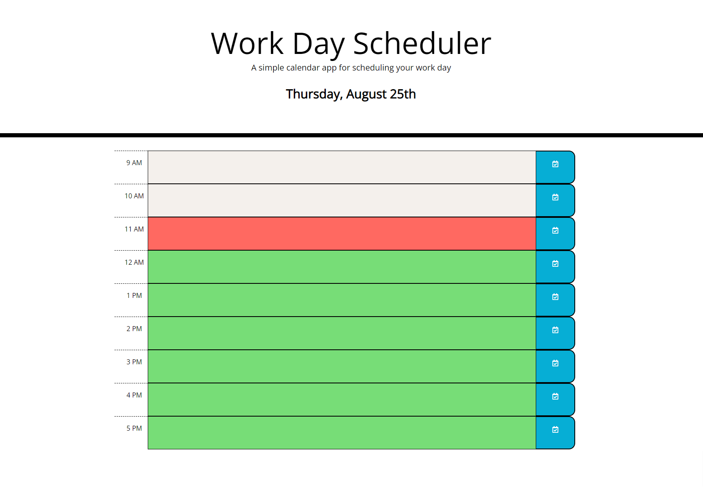

# work-day-scheduler
Module 05: Third-Party APIs

## Table of Contents
1. [Description](#Description)
2. [Visuals](#visuals)

## Description
This is a simple calendar application that allows a us
for each hour of the day. This app will run in a brows
dynamically updated HTML and CSS powered by jQuery.

[Link to live site](https://alyssa20lopez.github.io/work-day-scheduler/)

## Visuals
Here is a visual of the front-end of the webpage design.

